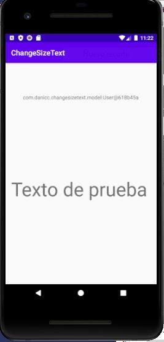

# ChangeSizeText

Autor:Daniel Casado Carvajal  
Fecha de Finalización del proyecto:06/10/2021

<h5>App realizada en Java con android Studio la cual consiste en dos activity, la primera envia un texto y un tamaño. En la segunda activity se muestra el texto con el tamaño seleccionado</h5>
<h4>Versión API:31</h4>
<h4>Minimun SDK:23</h4>

#  ¿Que hemos aprendido?
<h4>A continuacion se especifica todo el contenido aprendido en clase a lo largo del proyecto:</h4>

-Enviar datos de una activity a otra a traves de un bundle y un intent, tal como se hizo en el proyecto SendMessage  

-Uso del elemento seekBar. Los valores de las propiedades android:max y android:progress deben ser valores enteros y no en dp  

-Los datos que la activity ChangeSizeTextActivity le envia a ViewMessageActivity se encuentran en la clase message, la cual tiene 3 campos: 
<ul>
  <li>User:Sera una instancia de otra clase llamada User</li>
  <li>Message: Sera un valor de tipo String </li>
  <li>Size: Sera un valor de tipo Integer </li>
</ul>
la clase User contiene lo siguiente:
<ul>
  <li>name: sera un valor de tipo String</li>
  <li>email: sera un valor de tipo String</li>
</ul>

-Creacion de una clase que hereda de application (ChangeSizeApplication),ya que queremos que la clase User sea visible en cualquier activity. Al sobrescribir la
clase application , la clase ChangeSizeApplication hereda todo el contexto de nuestra aplicacion.

-Para que la clase ChangeSizeApplication funcione como si fuera nuestra clase Application, debemos ir al AndroidManifest.xml y cambiar el nombre de application
por nuestra clase ChangeSizeApplication.

-Ambas clases (Message y User) deben implementar la interfaz Serializable para poder ser recogidas en un Intent

-Por ultimo debemos obtener el objeto User de la clase Application en nuestra Activity. Para conseguirlo lo haremos a través del contexto de Application (getApplication()), recordando que la sobrescribimos por nuestra clase (ChangeSizeApplication) por lo que necesitaremos hacerle un casting.

 Bundle bundle= new Bundle();

        //Para obtener el usuario de la clase Applicaction: obtenemos la clase Application (getApplication()),
        //hacemos casting a ChangeSizeApplication
        // utilizamos getUser(). para coger el usuario
        Message message= new Message(((ChangeSizeApplication)getApplication()).getUser(),
                binding.edTexto.getText().toString(),binding.skSize.getProgress());

Para finalizar se muestra una de las pantallas de nuestra aplicacion en funcionamiento.

# Documentacion utilizada
<a>https://moronlu18.com/wordpress/</a>
